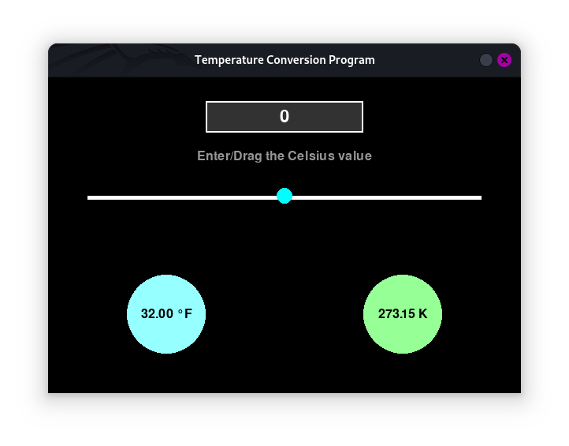

# PRODIGY_SD_01
Software Development Internship of InfoTech Prodigy

## Temperature Conversion Program

A user-friendly temperature conversion tool built using **Pygame**. This project is part of a task for the **Prodigy Infotech Internship**. It demonstrates the integration of GUI components, interactive elements, and dynamic animations.

### Features

- **Interactive Input Methods**:
  - Enter temperature values directly in the text field.
  - Drag or click on the horizontal slider to set temperature values.
- **Real-Time Conversion**:
  - Converts the input temperature in Celsius to **Fahrenheit** and **Kelvin** dynamically.
- **Hover Effects and Animations**:
  - Text field and slider ball highlight on hover.
  - Instruction text fades in, out, and blinks when the value is `0`.
- **Clean and Intuitive Interface**:
  - Color-coded results for better readability.

---

### Screenshot



---

### How to Run the Program

1. Clone this repository to your local machine:
   ```bash
   git clone https://github.com/your-username/temperature-conversion-program.git
   cd temperature-conversion-program
   ```

2. Install the required dependencies:
   ```bash
   pip install pygame
   ```

3. Run the program:
   ```bash
   python run.py
   ```

---

### Usage Instructions

- **Input Temperature**:
  - Type the value in the text box or drag the slider to select a value.
  - The circles below will display the converted temperatures.
- **Interactive Features**:
  - Hover over the text field or slider for visual feedback.
  - Instruction text blinks to guide users when the temperature is zero.

---

### Technologies Used

- **Python**: The core programming language.
- **Pygame**: For GUI and interactive elements.

---

### Contributing

Contributions are welcome! If you'd like to improve this project, feel free to fork the repository and create a pull request.

1. Fork the project.
2. Create a feature branch:
   ```bash
   git checkout -b feature/AmazingFeature
   ```
3. Commit your changes:
   ```bash
   git commit -m "Add some AmazingFeature"
   ```
4. Push to the branch:
   ```bash
   git push origin feature/AmazingFeature
   ```
5. Open a pull request.

---

### License

This project is licensed under the [MIT License](LICENSE).

---

### Author

**Shamir Ashraf**  
Connect on [LinkedIn](https://www.linkedin.com/in/shamiroxs) or [GitHub](https://github.com/shamiroxs).
